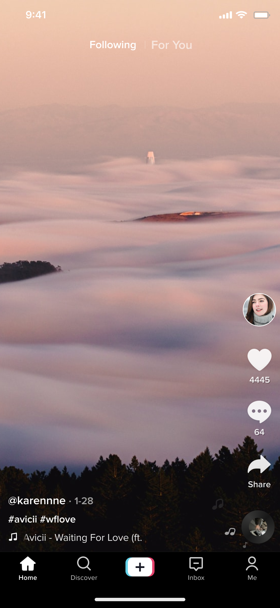
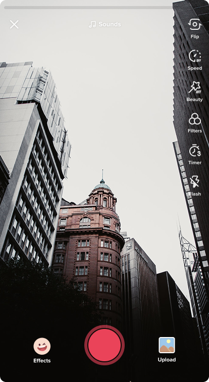

# React Native Task

This project was developed as part of a **InstaCodigo Internship Task**.  
The goal was to build a **TikTok-like video feed app** using [Expo](https://expo.dev), focusing on **UI/UX, smooth scrolling, and reusable components**

## Demo Video

👉 [Watch Full Demo Video](https://drive.google.com/file/d/1kpqYHlmVZu9M2v0I2TDxvrO1WxGfLqFx/view?usp=sharing)

---

## Application Images

  
  

  
  

---

## Design Guideline (Figma Kit)

This is the design file I followed as a reference to build the app:

  
  

  
  

  

---

## 📑 Pages / Layout

1. Home
2. Discover
3. Camera (Expo Camera)
4. Inbox
5. Profile

---

## 🛠️ Technologies Used

- **React Native (with Expo)** → cross-platform app development
- **Expo Router** → navigation and structure
- **Expo Video** → video playback
- **Expo Camera** → camera functionality
- **NativeWind (Tailwind for React Native)** → styling
- **React Native Reanimated** → smooth animations
- **Vector Icons (Ionicons)** → icons and UI polish

---

## 🚀 Get Started

1. Install dependencies:
   `bash npm install`

2. Start the app:
   `npx expo start`
